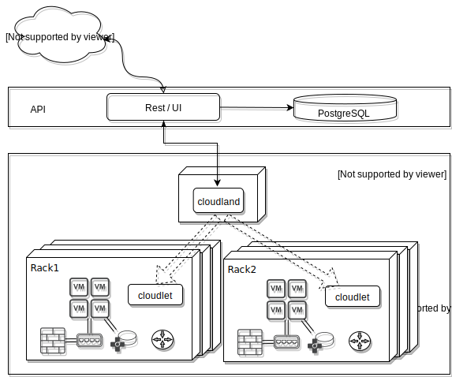
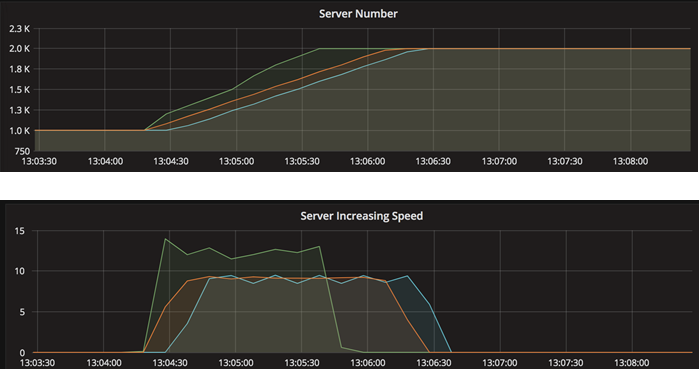
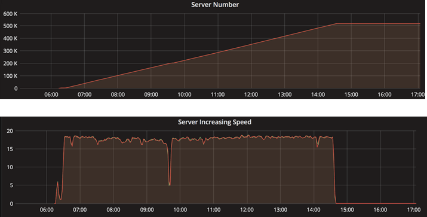
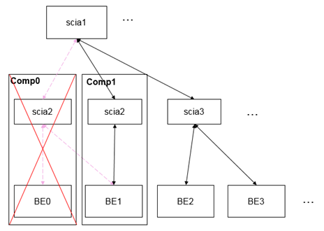

# Overview
Cloudland is a light weight IaaS framework to manage VM instances, software defined networks (SDN), and volumes. It can be used for large scale public cloud as well as small scale private cloud such as hyper converged infrastructure (HCI).

The objective of this project is to develop a simple and extensible IaaS with easy operations to save everybody's time.

# Architecture

# Functionalities
## Provision instances based on KVM
As an IaaS solution, this is the main function for CloudLand. On top of it, people can freely deploy PaaS such as kubernetes.
## Software defined networks (SDN)
CloudLand has a builtin simple SDN solution based on vxlan, with extensions, instances cross different regions or data centers can talk seamlessly.
## Dynamic storage
The volume solution is based on Gluster. Gluster has native integration with qemu which does not rely on fuse, this brings the benifit of efficiency.

## Security
Security-group is based on iptables

# Technology
The architecture is mainly based on HPC (High Performance Computing) technology SCI (Scalable Communication Infrastructure) which is an Eclipse OpenSource project https://wiki.eclipse.org/PTP/designs/SCI. 

SCI library is embedded in IBM HPC PTP product and adopted by PERCS, NCSA and Eclipse parallel debugger... The tree based hierarchical architecture makes it extremely high scalability. 

# Advantages 
## High performance and scalability
The benchmark of launching VMs shows ~50 VMs per hyper per minute

The long run shows 500k VMs distributed across 20k hypervisors, over 99.99% success rate

## High stability and auto failover/recovery
   

Cloudland frontend, agents, backends have heart beat in seconds, it has auto-reconnect and auto-rescue mechanism throughout the tree, the disruptive test proves the ability of auto-recovery and stability of the whole system.
### Simplicity is the best of all
Cloudland hasn't tons of components like other IaaS solutions. The development is straightforward which makes it a flat learning curve for developers, and the simple deployment and stability means a easy, hands off maintenance for operators.
