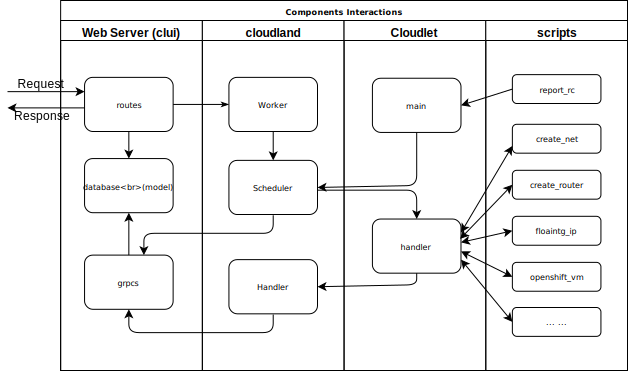

# Services Start / Stop
## Web Server
```
systemctl start hypercube
systemctl stop hypercube
```
## Cloudland
```
systemctl start cloudland
systemctl stop cloudland
```
## Cloudlet
```
systemctl start cloudlet
systemctl stop cloudlet
```
## SCI Daemon
```
systemctl start scid
systemctl stop scid
```
# Configuration Files
## Web Server
* /opt/cloudland/web/clui/conf/config.toml
## Cloudland
* /opt/cloudland/etc/host.list
* /etc/sysconfig/cloudland
## Cloudlet
* /etc/sysconfig/cloudlet

# Code Layout
## Web server
This part is in go language, it has all rest APIs and web pages implemented. web/clui is the main function directory. 
* routes/routes.go is a good entry point to start with as it defines the url paths mapping to the functions.
* model defines the database schema and data structure
* grpcs handles grpc sending and callbacks to cloudland
## Cloudland
This part is in c++ language, it has binary cloudland for frontend and cloudlet for backends. Cloudland and cloudlets are structured into a tree hierarchy. Cloudland is the tree root can be running in a VM, cloudlets are running on hypervisors one on each which manages the hypervisor resources. The protocol between web(clui) and cloudland is gRPC. The communication between cloudland and cloudlets is through SCI library. Directory filter has the scheduler to parse and handle the messages passing by both down streaming and up streaming, this is mainly for resources. It is compiled to a dynamic linking library and running inside of frontend and SCI agents.
## SCI
Scalable communication Infrastructure -- A copy with some extensions of eclipse SCI: https://wiki.eclipse.org/PTP/designs/SCI, usually you don't need to modify this part.
## Scripts
The final working instructions called by cloudlet. Typically, when a user demands a request from web ui, it will become some executions on hypervisors eventually. This part contains many scripts for different function units. Most scripts are executed on demand except report_rc.sh, which runs periodically sending resources information to upstream.
## Deploy
The install scripts and ansible playbooks.

# Work Flow

1. User sends a request through web gui or cli
1. Web server (clui) receives the request, generates one or more commands and sends them to cloudland
1. Cloudland receives the commands and pass them to cloudlet. Resource calculation is determined by scheduler running inside of frontend (cloudland) and SCI agents as mentioned above.
1. Cloudlet receives the command and call the script for final execution. It catches all the output of the scripts and sends it back to cloudland.
1. Cloudland receives the command execution output, filters out the lines with key word |:COMMAND:| and sends them back to web server (clui).
1. Web server (clui) receives the command from cloudland, parse it and run the callback functions accordingly.

# Logs
## Web Server
When clui is launched by system service hypercube, the log is in syslog -- /var/log/messages. For development, you can stop the hypercube service and run it in foreground
```
cd /opt/cloudland/web/clui
sudo ./clui --daemon
``` 
Then it logs into console
## Cloudland
/opt/cloudland/log is the log directory for cloudland, the log file is named in hostname.pid.cloudland.log, this log contains all interactions with upstream web server as well as commands output from downstream distributed hypervisors. It is the most important log for debugging.
## Cloudlet
Same directory /opt/cloudland/log as cloudland, it records communications error when it happens.